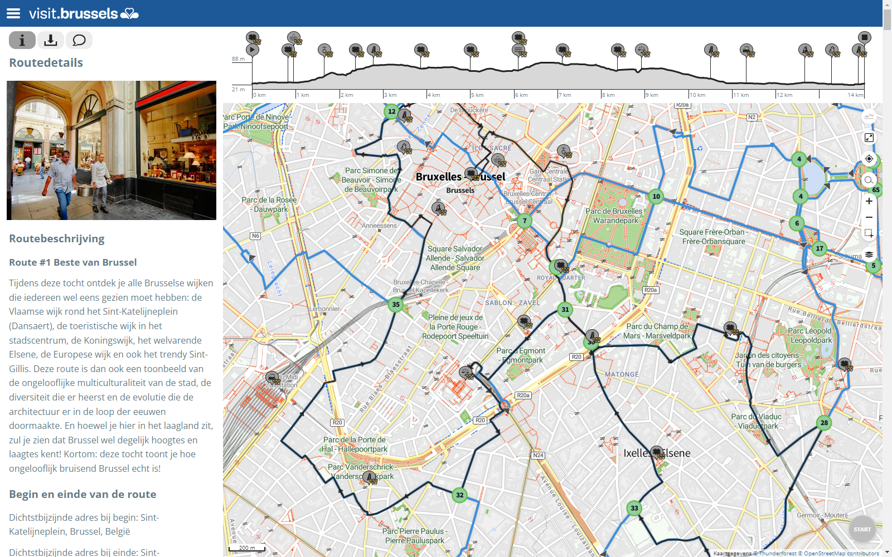

#Deployment

Scripts and code specificly for deployment. One example being containerization.

## The static version of the LA app

In this version routes will be pregenerated and stored in a RouteYou PRO account. 

- The LA app will take on the following form: [mvisit brussels](https://mvisitbrussels.routeyou.com)
- Current version: we are internally reviewing the routes generated by the AI and will publish them when finished.

Screenshot of RouteYou PRO account. The LA app will look very similar, with the routes being pushed via the RY APIs.

## Version 2: dynamic querying (WIP)

The version we are preparing for the event at June 2/3 will allow user to do live queries on the map of the city of Ghent for thematic routes. 